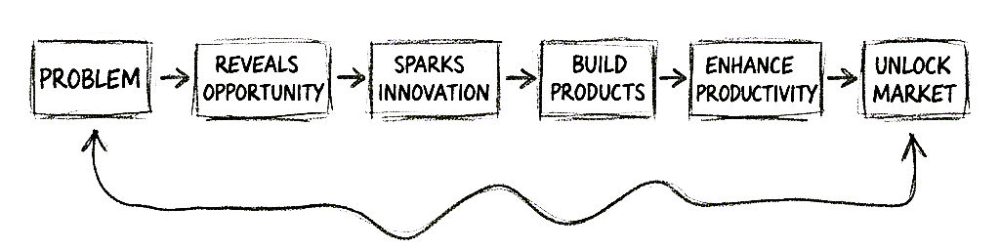

<table>
  <tr>
    <td>
      
    </td>
    <td style="vertical-align:top; padding-left:15px;">

# 💼 **Raguram Narayanaswamy**
> **Product Management | Product Enhancement | UX Research | UX Design | User Acceptance Testing**
> - **2+ years of experience @ Amazon Development Centre**
---
📧 **Email:** [raguramcdm@gmail.com](mailto:raguramcdm@gmail.com)                                
📞 **Phone:** +91 88701 80822  
🎓 **Education:** B.E - EIE (2015–2019)  
🏛️ **College:** St. Joseph's College of Engineering, Chennai  
📍 **Location:** Chennai, Tamil Nadu, India  

</td>
  </tr>
</table>

---
 

  

 Product Innovation: *An AI-powered tool that reads test steps from Word files, executes Selenium-based tests, captures screenshots on failures, and generates intelligent test reports — reducing manual testing effort by 70%.*

### 2️⃣ [Personalized Keyword Subscription – The Hindu](https://github.com/Raguram-N/The_Hindu/blob/main/README.md)
> UX Innovation for Business Growth: *A smart newspaper personalization feature that lets readers subscribe to their favorite keywords and topics — making news consumption more relevant and time-efficient.*

### 3️⃣ [Tik-Tik – Smart Timer Delivery System](https://github.com/Raguram-N/Tik-Tik_-_Smart_Delivery/blob/main/README.md)
> UX Innovation for Business Growth: *A delivery timer system that provides transparent countdown tracking between customers and delivery partners — ensuring trust, accuracy, and reduced waiting anxiety.*

### 4️⃣ [Track the Game – Analyze, Adapt, Achieve → Dominate](https://github.com/Raguram-N/Track-The-Game/blob/main/README.md)
>  Product Innovation: *A data-driven sports performance tracker that analyzes player metrics to enhance strategy, adaptability, and competitive growth.*

### 5️⃣ [Care Partner – Seamless & Safe City Travel](https://github.com/Raguram-N/Smart-Multi-Stop-Ride---case-study/blob/main/README.md)
> UX Innovation for Business Growth: *A multi-stop ride management system focusing on safety, comfort, and assisted navigation — designed for caregivers and senior-friendly mobility.*

### 6️⃣ [Conscious MB – Data-Aware Video Streaming](https://github.com/Raguram-N/Conscious-MB/blob/main/README.md)
> UX Innovation for Business Growth: *A YouTube feature concept that predicts mobile data usage per video quality and enables users to reserve data for emergencies — promoting mindful digital consumption.*

### 7️⃣ [Smart Backup Address – For Delivery](https://github.com/Raguram-N/Smart-Backup-Address-Delivery/blob/main/README.md)
> UX Innovation for Business Growth: *A UX concept that enables smart fallback delivery to a nearby secondary address (within a 1 km radius) — ensuring reliability when the primary recipient is unavailable.*

### 8️⃣ [Software Development Life Cycle (SDLC) - The story](https://github.com/Raguram-N/SDLC-The-Simple-Story/blob/main/README.md)
> Learning Series: *A story-based guide to software Life development cycle, making planning, creation, testing, and delivery concepts easy to grasp. “A process of serving the customer’s hunger with satisfaction, care, and quality.”*

### 9️⃣ [NearMind - Location Based Smart Reminder App](https://github.com/Raguram-N/NearMind-Location-Based-Smart-Reminder-App-/blob/main/README.md)
> Product Innovation: *A mobile-first, GPS-powered smart reminder app that notifies users exactly when they reach the location of their task — ideal for groceries, medicines, exams, office errands, and personal pickups.*

### 1️⃣0️⃣ [Software Development Life Cycle (SDLC) methodologies - Agile vs Waterfall](https://github.com/Raguram-N/Agile-vs-Waterfall/blob/main/README.md)
> Learning Series: *An intuitive story-driven explanation of Agile and Waterfall SDLC methodologies, using a real-world car journey analogy to simplify software development concepts.*

### 1️⃣1️⃣ [Lets Debug AI - Artificial intelligence enabling human potential](https://github.com/Raguram-N/Lets-Debug-AI/blob/main/README.md)
> Learning Series: *A story-driven scenario demonstrating how AI can assist humans in achieving their goals, while human skill and decision-making remain essential. “AI enables, humans excel.”*

### 1️⃣2️⃣ [My work as QA - Buggy Car Rating Web Application](https://github.com/Raguram-N/My_QA_Sample_Project/blob/main/README.md)
> Skill Showcase: *This document showcases my software testing expertise. The purpose of this testing goes beyond identifying functional bugs, reflecting a customer-centric approach to quality assurance.*

### 1️⃣3️⃣ [Power BI - Data Visualization](https://github.com/Raguram-N/Power-BI-analysis/blob/main/README.md)
> Skill Showcase: *This project highlights my business analysis and data visualization skills using Power BI.
I transformed raw datasets into insightful, interactive dashboards, enabling data-driven decision-making.*

### 1️⃣4️⃣ [A/B Testing - the story](https://github.com/Raguram-N/A-B-Testing/blob/main/README.md)
> Learning Series: *A practical demonstration of A/B testing concepts through a real-life analogy. This project explains how businesses test two versions of a product to determine which performs better — optimizing user experience and driving decisions.*

### 1️⃣5️⃣ [User Acceptance Testing (UAT) – The Story](https://github.com/Raguram-N/User-Acceptance-Testing-UAT-/blob/main/README.md)
> Learning Series: *A story-driven explanation of User Acceptance Testing (UAT). This project demonstrates how UAT ensures that software meets business requirements and end-user expectations, validating the final outcome before deployment.*

### 1️⃣6️⃣ [Design principles - Turning Creativity into Usability](https://github.com/Raguram-N/design-principles/blob/main/README.md)
> Learning Series: *Design principles are the rules of thumb that make interfaces visually appealing, easy to navigate, and enjoyable to use — without confusing the user.*

### 1️⃣7️⃣ [Fundamentals of Architecture - The Pillars of Software system](https://github.com/Raguram-N/-Fundamentals-of-architecture/blob/main/README.md)
> Learning Series: *Understanding the fundamentals of Architecture provides the framework and discipline that transform code into a stable, scalable, and maintainable product.*

### 1️⃣8️⃣ [Principles of Interactive Design - how users engage with digital interfaces](https://github.com/Raguram-N/Principles-of-Interactive-Design/blob/main/README.md)
> Learning Series: *Interactive Design (IxD) focuses on creating the relationship between a user and a digital product, making sure that interactions with apps, websites, or dashboards are intuitive, efficient, and enjoyable.*

### 1️⃣9️⃣ [All-Time Low Pass - Predict. Claim. Save](https://github.com/Raguram-N/All-Time-Low-Pass-/blob/main/README.md)
> UX Innovation for Business Growth: *A gamified price protection concept that rewards users for predicting price drops — turning everyday shopping into an engaging, loyalty-driven experience.* 

### 2️⃣0️⃣ [Link2Watch – Friendly Streaming](https://github.com/Raguram-N/Smart-play---For-Elders/blob/main/README.md)
>  UX Innovation for Business Growth: *Innovation that bridges the tech gap for elderly parents, allowing family members to send a movie via link that plays instantly on TV — “Send a link, share a moment""*

### 2️⃣1️⃣ [Coming Soon… ⏳](https://github.com/Raguram-N/Me/blob/main/README.md)
> *More in progress — stay tuned!*

     
       

> **Thank you for visiting! 🙂 
I truly appreciate your time and interest. 
I’m currently open to work and excited to explore new opportunities where I can contribute, learn, and grow.**

---

## ⚠️ **Disclaimer**

This repository and its contents represent **independent product concepts, UX enhancements, and prototypes** created by **Raguram Narayanaswamy**. These works are intended solely for **educational, portfolio, and demonstration purposes**. They are **not affiliated with, endorsed by, or sponsored by any third-party companies or organizations** mentioned within (e.g., YouTube, Rapido, The Hindu, etc.).  
> All trademarks, brand names, and product names belong to their respective owners.

---

## ⚖️ **License**

This work is protected under **Creative Commons Attribution–NonCommercial–NoDerivatives 4.0 International License (CC BY-NC-ND 4.0)**.  

> You may **view and share** this repository **with proper credit**, but **commercial use, modification, or redistribution** are **not permitted**.  
🔗 [View Full License](https://creativecommons.org/licenses/by-nc-nd/4.0/)

---

## © **Copyright Notice**

© 2025 **RAGURAM NARAYANASWAMY**   
All rights reserved.

> Unauthorized copying, distribution, or reproduction of this content, in whole or in part, is strictly prohibited without prior written permission from the author.

