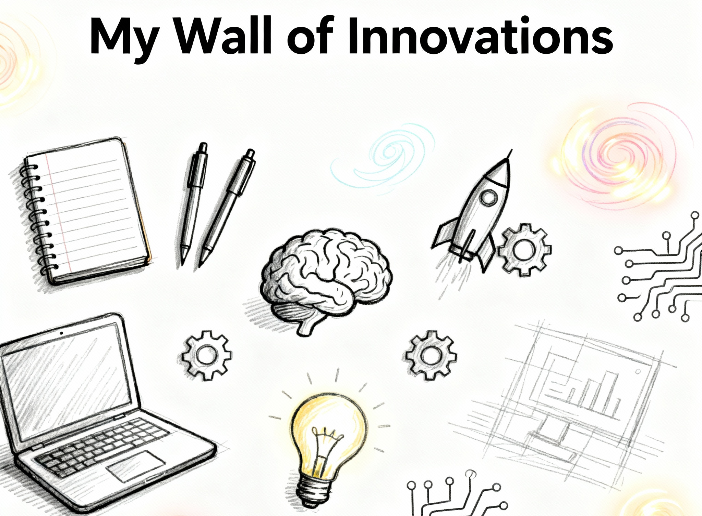

<table>
  <tr>
    <td>
      
    </td>
    <td style="vertical-align:top; padding-left:15px;">

# 💼 **Raguram Narayanaswamy**
> **Product Innovation | Product Enhancement | UX Research | User Flow Testing Expert | User-centric**
> - **2+ years of experience @ Amazon Development Centre**
---
📧 **Email:** [raguramcdm@gmail.com](mailto:raguramcdm@gmail.com)                                
📞 **Phone:** +91 88701 80822  
🎓 **Education:** B.E - EIE (2015–2019)  
🏛️ **College:** St. Joseph's College of Engineering, Chennai  
📍 **Location:** Chennai, Tamil Nadu, India  

</td>
  </tr>
</table>

---
 

  

 **✨ “Problem → Reveals Opportunity → Sparks Innovation → Build Products → Enhance Productivity → Unlock Market.”**

---

## 🚀 **Projects & Case Studies**

### 1️⃣ Product Innovation: [Just Click – AI Manual Tester](https://github.com/Raguram-N/AI_Manual_Tester/blob/main/README.md)
> *AI-powered manual testing automation tool that reads test steps, executes Selenium-based tests, and generates intelligent reports.*

### 2️⃣ Product Enhancement: [Personalized Keyword Subscription – The Hindu](https://github.com/Raguram-N/The_Hindu/blob/main/README.md)
> *A smart newspaper personalization concept that lets readers subscribe to their favorite topics, not just sections.*

### 3️⃣ Product Enhancement: [Tik-Tik – Smart Timer Delivery System](https://github.com/Raguram-N/Tik-Tik_-_Smart_Delivery/blob/main/README.md)
> *A UX-driven delivery timer system ensuring transparency between customers and delivery partners.*

### 4️⃣ Product Innovation: [Track the Game – Analyze, Adapt, Achieve → Dominate](https://github.com/Raguram-N/Track-The-Game/blob/main/README.md)
> *A data-analytics-driven sports performance tracker enhancing player strategy and growth.*

### 5️⃣ Product Enhancement: [Care Partner – Seamless & Safe City Travel](https://github.com/Raguram-N/Smart-Multi-Stop-Ride---case-study/blob/main/README.md)
> *A multi-stop ride management system designed for safety, comfort, and care-based navigation.*

### 6️⃣ Product Enhancement: [Conscious MB – Data-Aware Video Streaming](https://github.com/Raguram-N/Conscious-MB/blob/main/README.md)
> *A UX concept for YouTube that predicts MB usage per video quality and lets users reserve data for emergencies.*

### 7️⃣ Coming Soon... ⏳  
> *More innovations in progress – stay tuned!*

 

  
 

  
---

## ⚠️ **Disclaimer**

This repository and its contents represent **independent product concepts, UX enhancements, and prototypes** created by **Raguram Narayanaswamy**.  
These works are intended solely for **educational, portfolio, and demonstration purposes**.  

They are **not affiliated with, endorsed by, or sponsored by any third-party companies or organizations** mentioned within (e.g., YouTube, Rapido, The Hindu, etc.).  
All trademarks, brand names, and product names belong to their respective owners.

---

## ⚖️ **License**

This work is protected under the  
**Creative Commons Attribution–NonCommercial–NoDerivatives 4.0 International License (CC BY-NC-ND 4.0)**.  

You may **view and share** this repository **with proper credit**, but **commercial use, modification, or redistribution** are **not permitted**.  

🔗 [View Full License](https://creativecommons.org/licenses/by-nc-nd/4.0/)

---

## © **Copyright Notice**

© 2025 **RAGURAM NARAYANASWAMY**  
Part of the *Wall of Innovations* series.  
All rights reserved.

> Unauthorized copying, distribution, or reproduction of this content, in whole or in part, is strictly prohibited without prior written permission from the author.

---
