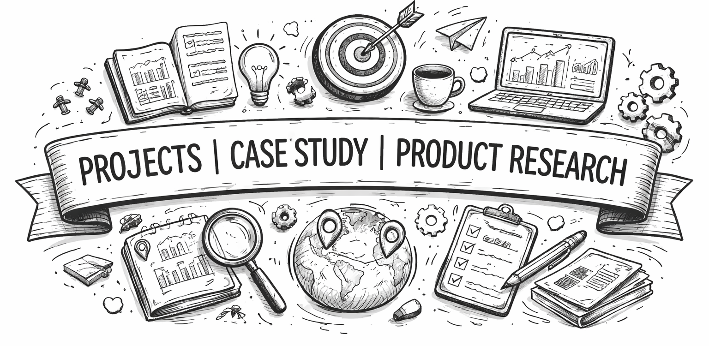

 

  

  </tr>

A curated showcase of my product innovations, UX enhancements, and creative solutions designed to solve real-world problems. With 2+ years of experience at Amazon and understanding of sociology and psychology, this repository highlights prototypes, case studies, and hands-on projects that demonstrate my approach to user-centered design, product thinking, problem-solving and knowledge sharing. 

---

  

 

  
| Project | Description | Link | prototype
|--------|-------------|------|------|
| **1️⃣ Care Partner (Rapido)** | Multi-stop ride model for seniors & caregivers. | [View](https://github.com/Raguram-N/Smart-Multi-Stop-Ride---case-study/blob/main/README.md) | [Prototype](https://raguram-n.github.io/Smart-Multi-Stop-Ride---case-study/)
| **2️⃣ Trustpaisa — Smart Savings** | bridges the gap between desire and affordability | [View](https://github.com/Raguram-N/Trustpaisa-Smart-Savings/blob/main/README.md) | [Prototype](https://raguram-n.github.io/Trustpaisa-Smart-Savings/)
| **3️⃣ Power BI – Dashboards** | Converts raw data into business insights. | [View](https://github.com/Raguram-N/Power-BI-analysis/blob/main/README.md) | [NA](https://github.com/Raguram-N/Power-BI-analysis/blob/main/README.md)
| **4️⃣ A/B Testing – The Story** | Real-life analogy explaining A/B testing. | [View](https://github.com/Raguram-N/A-B-Testing/blob/main/README.md) | [NA](https://github.com/Raguram-N/A-B-Testing/blob/main/README.md)
| **5️⃣ Conscious MB (YouTube)** | Predicts mobile data usage per video quality. | [View](https://github.com/Raguram-N/Conscious-MB/blob/main/README.md) | [Prototype](https://raguram-n.github.io/Conscious-MB/)
| **6️⃣ EduVerse — VR Learning** | Knowledge isn’t just reading, it’s an experience | [View](https://github.com/Raguram-N/kiksarvr-EduVerse/blob/main/README.md) | [Prototype](https://raguram-n.github.io/kiksarvr-EduVerse/)
| **7️⃣ Smart Backup Address (Amazon)** | Fallback delivery within 1 km to boost success rate. | [View](https://github.com/Raguram-N/Smart-Backup-Address-Delivery/blob/main/README.md) | [Prototype](https://raguram-n.github.io/Smart-Backup-Address-Delivery/)
| **8️⃣ SDLC – The Story** | Beginner-friendly story of the Software Development Life Cycle. | [View](https://github.com/Raguram-N/SDLC-The-Simple-Story/blob/main/README.md) | [NA](https://github.com/Raguram-N/SDLC-The-Simple-Story/blob/main/README.md)
| **9️⃣ NearMind – Smart Reminder** | GPS-powered reminders triggered by location. | [View](https://github.com/Raguram-N/NearMind-Location-Based-Smart-Reminder-App-/blob/main/README.md) | [Prototype](https://raguram-n.github.io/NearMind-Location-Based-Smart-Reminder-App-/)
| **🔟 Agile vs Waterfall – The Story** | Story-based comparison of development models. | [View](https://github.com/Raguram-N/Agile-vs-Waterfall/blob/main/README.md) | [NA](https://github.com/Raguram-N/Agile-vs-Waterfall/blob/main/README.md)
| **1️⃣1️⃣ Let’s Debug AI** | How AI supports human productivity with human-led decisions. | [View](https://github.com/Raguram-N/Lets-Debug-AI/blob/main/README.md) | [NA](https://github.com/Raguram-N/Lets-Debug-AI/blob/main/README.md)
| **1️⃣2️⃣ QA sample Work** | Demonstrates usability analysis & functional QA. | [View](https://github.com/Raguram-N/My_QA_Sample_Project/blob/main/README.md) | [NA](https://github.com/Raguram-N/My_QA_Sample_Project/blob/main/README.md)
| **1️⃣3️⃣ Tik-Tik – Smart Timer Delivery** | Delivery countdown system reducing anxiety and improving trust. | [View](https://github.com/Raguram-N/Tik-Tik_-_Smart_Delivery/blob/main/README.md) | [Prototype](https://raguram-n.github.io/Tik-Tik_-_Smart_Delivery/)
| **1️⃣4️⃣ Just Click – AI Manual Tester** | AI-powered testing engine that reduces manual effort by **70%**. | [View](https://github.com/Raguram-N/AI_Manual_Tester/blob/main/README.md) | [Prototype](https://raguram-n.github.io/AI_Manual_Tester/)
| **1️⃣5️⃣ UAT – The Story** | How UAT validates business expectations. | [View](https://github.com/Raguram-N/User-Acceptance-Testing-UAT-/blob/main/README.md) | [NA](https://github.com/Raguram-N/User-Acceptance-Testing-UAT-/blob/main/README.md)
| **1️⃣6️⃣ Design Principles** | Ensures clarity, consistency, and visual balance. | [View](https://github.com/Raguram-N/design-principles/blob/main/README.md) | [NA](https://github.com/Raguram-N/design-principles/blob/main/README.md)
| **1️⃣7️⃣ Fundamentals of Architecture** | Introduction to scalable, reliable system architecture. | [View](https://github.com/Raguram-N/-Fundamentals-of-architecture/blob/main/README.md) | [NA](https://github.com/Raguram-N/-Fundamentals-of-architecture/blob/main/README.md)
| **1️⃣8️⃣ Principles of Interactive Design** | How humans interact with interfaces & usability thinking. | [View](https://github.com/Raguram-N/Principles-of-Interactive-Design/blob/main/README.md)| [NA](https://github.com/Raguram-N/Principles-of-Interactive-Design/blob/main/README.md)
| **1️⃣9️⃣ All Time Low Pass (Amazon)** | Gamified price drop prediction & rewards. | [View](https://github.com/Raguram-N/All-Time-Low-Pass-/blob/main/README.md) | [NA](https://github.com/Raguram-N/All-Time-Low-Pass-/blob/main/README.md)
| **2️⃣0️⃣ Keyword Subscription – epaper** | Lets readers subscribe to keywords for personalized news. | [View](https://github.com/Raguram-N/The_Hindu/blob/main/README.md) | [Prototype](https://raguram-n.github.io/The_Hindu/)
| **2️⃣1️⃣ Link2Watch (Netflix)** | Elder-friendly link-based streaming system. | [View](https://github.com/Raguram-N/Smart-play---For-Elders/blob/main/README.md) | [Prototype](https://raguram-n.github.io/Smart-play---For-Elders/)
| **2️⃣2️⃣ Track the Game – Sports Analyzer** | Data-driven performance tracker for athletes. | [View](https://github.com/Raguram-N/Track-The-Game/blob/main/README.md) | [Prototype](https://raguram-n.github.io/Track-The-Game/)
| **2️⃣3️⃣ DriveXR — driver training** | Safe drivers aren’t born on roads — they’re trained in experiences | [View](https://github.com/Raguram-N/DriveXR/blob/main/README.md) | [Prototype](https://raguram-n.github.io/DriveXR/)
| **2️⃣4️⃣ Coming Soon…** | New product ideas and innovations on the way! | [View](https://github.com/Raguram-N/Me/blob/main/README.md) | [NA](https://github.com/Raguram-N/Me/blob/main/README.md)

       

---

*Disclaimer - This repository contains independent product concepts and prototypes created for educational and portfolio purposes only. It is not affiliated with or endorsed by any third-party companies mentioned. All trademarks and brand names belong to their respective owners.
